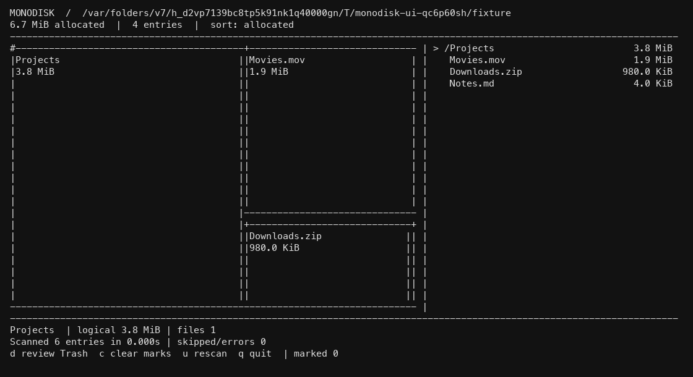

# Monodisk

A monochrome terminal disk explorer for Apple Silicon macOS.
TypeScript compiles to a standalone executable with [scriptc](https://github.com/vercel-labs/scriptc).
A C++ scanner calls `getattrlistbulk` through scriptc's native FFI.



## Run

Install mise and Apple's Command Line Tools, then:

```sh
mise trust
mise install
mise run install
mise run build
./dist/monodisk ~/Downloads
```

The mise configuration selects Bun's rolling canary release through its GitHub backend.
Refresh that mutable release with `mise install --force github:oven-sh/bun@canary`.
Node runs the compiler. The finished executable needs neither Node nor Bun.
Apple's SDK provides clang++; Rust and Zig are unnecessary for application builds.

## Controls

| Key                               | Action                                                       |
| --------------------------------- | ------------------------------------------------------------ |
| Arrows / hjkl                     | Select entries, enter folders, return to parent              |
| Enter / Backspace                 | Enter folder / return to parent                              |
| g / G                             | First / last entry                                           |
| s / r                             | Change sorting / reverse sorting                             |
| Space / a / c                     | Toggle selection / select current contents / clear selection |
| d                                 | Review marked entries for Trash                              |
| Y                                 | Confirm the displayed Trash operation                        |
| Any other key during confirmation | Cancel                                                       |
| u / q                             | Rescan / quit                                                |

Wide terminals show a proportional treemap and sortable contents sidebar.
Narrow terminals show the contents list. Details include logical size and subtree file count.
Zero-sized entries remain in the list. Partial subtrees display `!` and `PARTIAL`.
Non-ASCII and control characters display as `?`; cleanup uses native entry identities, never rendered names.

## Accounting and cleanup

Allocated bytes drive the treemap. Logical bytes describe file lengths.
Hard-linked bytes belong to the lexicographically first path; every name remains counted.
APFS clones and snapshots mean allocated bytes are not a promise of reclaimable space.
Symlinks are listed without traversal. Cloud-only directories and other mounts are skipped.
Unreadable or skipped subtrees remain visibly incomplete. An active filesystem is not an atomic snapshot.

Cleanup moves marked entries into `~/.Trash` using exclusive renames.
It never recursively unlinks files. Empty Trash separately when you want to reclaim storage.
Root removal, incomplete subtrees, stale identities, and substituted ancestors are rejected.
Ancestor selections subsume descendants. The app rescans after each cleanup attempt.
Moves across devices fail rather than copying or deleting originals.
Each entry moves independently; partial batch failures are reported with an errno.
Restore moved items manually from Trash; names carry a collision-resistant `monodisk-` prefix.

## Verification

```sh
mise run check
mise run test-native
uv run scripts/terminal_test.py
./dist/monodisk /Applications --snapshot
```

Checks include TypeScript, type-aware Oxlint, Oxfmt, dependency-cruiser, Fallow, and public-interface tests.
Native tests run AddressSanitizer and UndefinedBehaviorSanitizer against disposable fixtures.
The PTY test runs the compiled executable and captures its actual terminal output.

Packages hide implementation in subfolders. See [the module convention](src/packages/README.md).
Matt Pocock's workflow configuration lives in `docs/agents/`.

## Benchmark

Build the [BlitzTree](https://github.com/ahmedkhaleel2004/blitztree) reference through mise's mr-boxington:

```sh
mise exec -- mbx build --manifest-path /path/to/blitztree/Cargo.toml --release --bin bench
mise run bench -- /Applications /path/to/blitztree/target/release/bench artifacts/local/results.json
```

The harness warms both tools, alternates five runs, and compares process-wall medians.
Its success gate requires identical file counts, entry counts, allocated bytes, and zero scan errors.
See [BENCHMARKS.md](BENCHMARKS.md) for measured results and limits.
